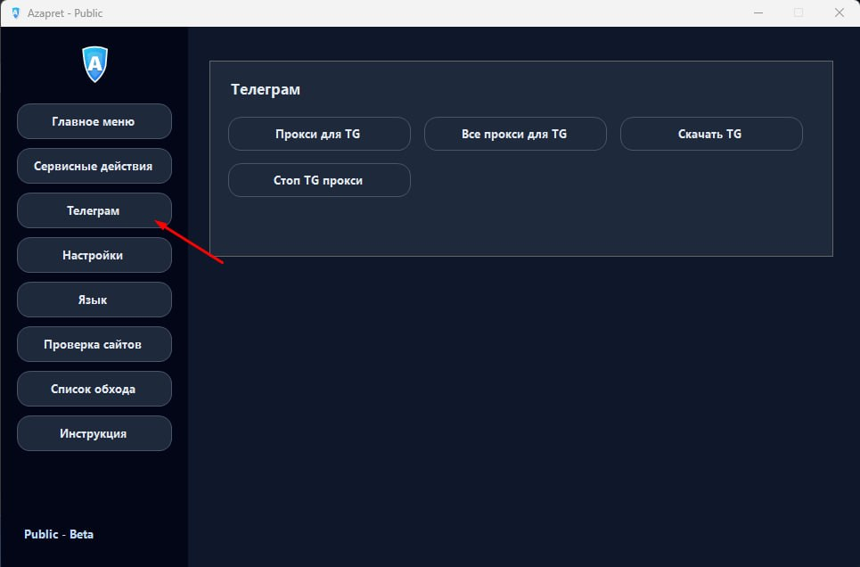
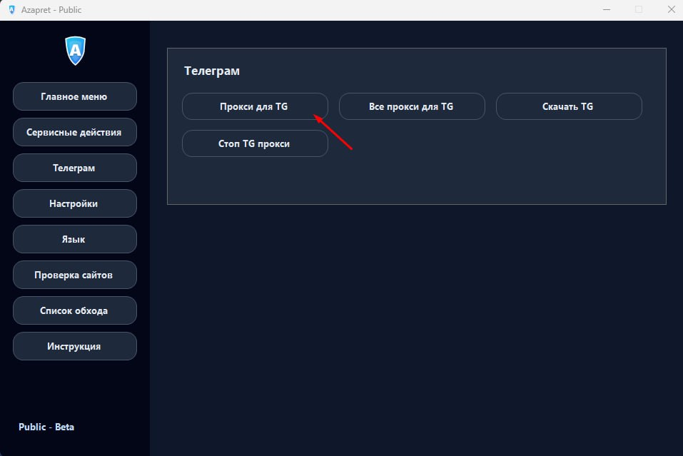
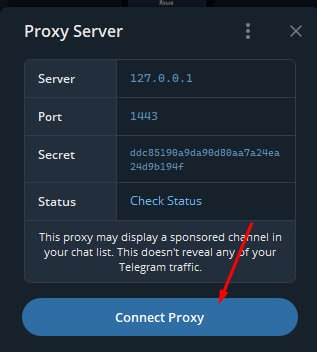
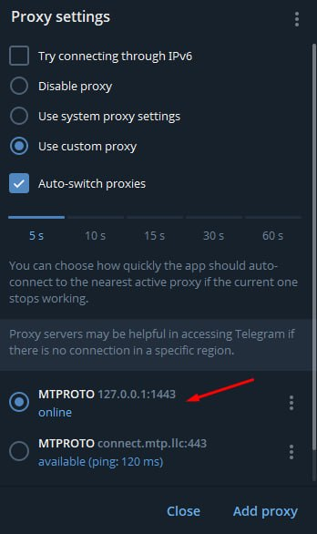

# Azapret FastApp Public

[](#быстрый-старт)
[](#azapret-fastapp-public)
[](release/AzapretApp-Public.zip)

Azapret FastApp Public - портативный Windows-лаунчер для запуска готовых профилей обхода без ручной работы с `.bat`, консолью и службами Windows.

Основная идея простая: скачали архив, распаковали, запустили `Azapret.exe`, выбрали обход и нажали `Старт` или `Автостарт`.

## Скачать

Основной архив Public-версии:

```text
release/AzapretApp-Public.zip
```

Прямая ссылка:

```text
https://github.com/Wizzyart/Azapret-dis-Inst-facebook-youtube-fastapp/raw/main/release/AzapretApp-Public.zip
```

Рекомендуемый путь распаковки:

```text
C:\AzapretApp-Public
```

Не запускайте приложение прямо из ZIP. Сначала полностью распакуйте архив в отдельную папку.

## Быстрый старт

1. Скачайте `AzapretApp-Public.zip`.
2. Распакуйте архив.
3. Запустите `Azapret.exe`.
4. Нажмите `Проверка сети`, чтобы подобрать подходящий профиль.
5. Нажмите `Старт` для ручного запуска.
6. Если всё работает, нажмите `Автостарт`, чтобы обход запускался вместе с Windows.

## Что входит в Public-версию

- Готовый лаунчер `Azapret.exe`.
- Профили обхода для популярных сайтов и приложений.
- Проверка сети и подбор подходящего профиля.
- Ручной запуск через `Старт`.
- Автостарт через службу Windows `zapret`.
- Кнопка `СТОП ВСЕ` для аварийного выключения обхода и служб.
- Фикс Instagram/Facebook через hosts.
- IPSet-фильтр и обновление списков.
- Встроенный локальный Telegram proxy.
- Русский интерфейс и дополнительные языки интерфейса.

## Telegram proxy

В Public-версии добавлен встроенный локальный Telegram MTProto proxy на базе `tg-ws-proxy`.

Как запустить:

1. Откройте вкладку `Телеграм`.
2. Нажмите `Прокси для TG`.
3. Azapret запустит локальный proxy на `127.0.0.1`.
4. Telegram откроет окно подключения proxy.
5. Подтвердите подключение в Telegram.

После успешного запуска Azapret добавляет отдельный автозапуск Telegram proxy в Windows. При следующем входе в Windows локальный proxy поднимется сам.

Если в Telegram уже есть старые записи `127.0.0.1:1443`, удалите их и добавьте proxy заново через кнопку `Прокси для TG`.

## Автостарт Telegram proxy

Для Telegram используется отдельный автозапуск:

```text
AzapretTGProxy
```

Он запускает `app\Start-TG-Proxy.ps1`, который перед стартом proxy записывает правильный конфиг `%APPDATA%\TgWsProxy\config.json` в UTF-8 без BOM. Это нужно, чтобы `secret` не менялся после перезагрузки.

Кнопка `Стоп TG прокси` останавливает локальный Telegram proxy и удаляет его автозапуск.

## Скриншоты Telegram









## Антивирус и SmartScreen

Windows Defender, SmartScreen или сторонний антивирус могут предупреждать о ZIP, `.exe`, `.bat`, `.ps1`, `winws.exe` или `WinDivert64.sys`.

Это ожидаемо для сетевых инструментов, потому что приложение запускает сетевые процессы, создаёт службы и работает с WinDivert.

Если Windows блокирует запуск:

1. Распакуйте архив в простую папку, например `C:\AzapretApp-Public`.
2. В свойствах ZIP или EXE нажмите `Разблокировать`, если такая кнопка есть.
3. Добавьте папку приложения в исключения антивируса, если доверяете сборке.
4. Запускайте `Azapret.exe` из распакованной папки.
5. Для автостарта подтвердите окно UAC от Windows.

Если вы не доверяете сборке, не запускайте её.

## Частые вопросы

### Нужно ли запускать от администратора?

Для обычного открытия интерфейса не всегда. Для запуска обхода, установки службы и некоторых сервисных действий нужны права администратора.

### Что делать, если сайт не открылся сразу?

Перезапустите вкладку браузера или сам браузер. Старые соединения могут оставаться открытыми до обновления страницы.

### Что делать, если Telegram proxy не подключается?

Удалите старые локальные proxy `127.0.0.1:1443` в Telegram и нажмите `Прокси для TG` в Azapret заново.

### Как полностью выключить обход?

Нажмите `СТОП ВСЕ`. Это остановит процессы обхода, удалит службы автозапуска и очистит DNS-кеш.

### Где добавить свои сайты?

Пользовательский список находится здесь:

```text
app\lists\list-general-user.txt
```

## Структура

```text
AzapretApp-Public/       исходная папка Public-сборки
release/                готовый ZIP для скачивания
docs/screenshots/       скриншоты для README и релиза
```

## Отказ от ответственности

Проект предоставляется как есть. Используйте его только там, где это разрешено вашими законами, правилами сети и условиями сервисов.

## Поддержать разработку

Если приложение оказалось полезным, можно поддержать дальнейшую разработку.

```text
USDT TRC20: TSHxLUkcRQno3hJQ1DAcx2UPEbjEMJsSUh
USDT ERC20: 0xcef2832570ebee0395b055127ca14b069916c70d
BTC:        1GdFQj3PZEJvPY6zHXT8j8brnB59bHHVs7
```
