# Azapret Discord YouTube Instagram Facebook FastApp

Public Windows launcher for fast selection, testing, and autostart setup of zapret-based Discord/YouTube bypass profiles.

The app is designed for non-technical users: choose a profile, run a network check, press Start or Autostart, and use the built-in service tools when needed.

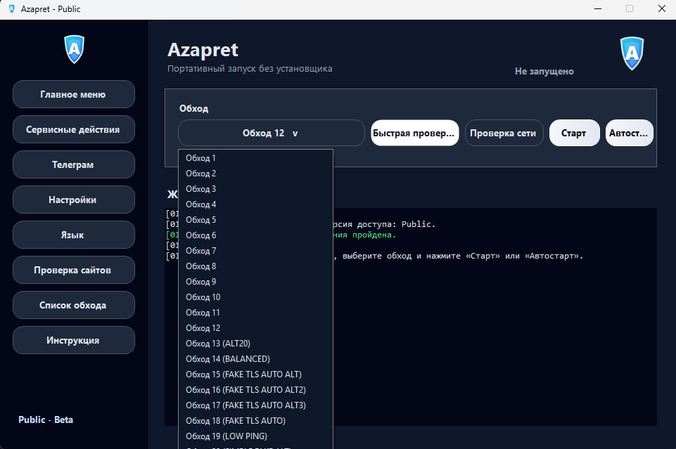

## Features

- Public launcher with clean Windows UI.
- One-click profile selection from bundled `general*.bat` bypasses.
- Network check with logging and recommended profile selection.
- Manual `Start` / `Stop` flow.
- Windows autostart via `zapret` service.
- `STOP ALL` to stop `winws.exe`, remove services, and flush DNS.
- Restart selected bypass without reopening the app.
- Game filter modes: Off, TCP + UDP, TCP only, UDP only.
- IPSet filter status modes: Loaded, None, Any.
- IPSet list updater.
- Instagram/Facebook hosts fix action.
- Telegram proxy page with guide screenshots.
- Multi-language UI: Russian, English, Chinese, Persian.
- Release ZIP is clean: no runtime logs, local settings, diagnostics, or test scripts.

## Download

Use the prebuilt archive:

```text
release/AzapretApp-Public.zip
```

Extract the ZIP before running. Do not run the app directly from inside the archive.

Recommended location:

```text
C:\AzapretApp-Public
```

Then run:

```text
Azapret.exe
```

## Quick Start

1. Extract `AzapretApp-Public.zip`.
2. Run `Azapret.exe`.
3. Press `Проверка сети` / `Network Check`.
4. Select the recommended profile or choose one manually.
5. Press `Старт` / `Start` for manual launch.
6. Press `Автостарт` / `Autostart` to install the selected profile as a Windows service.

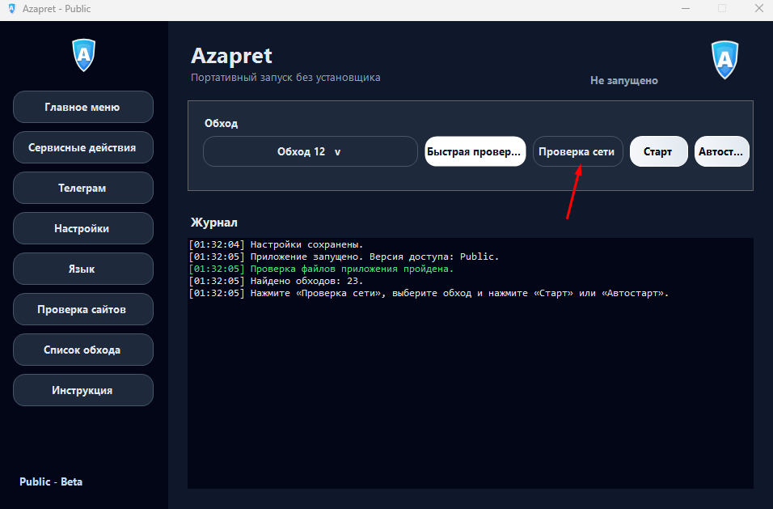

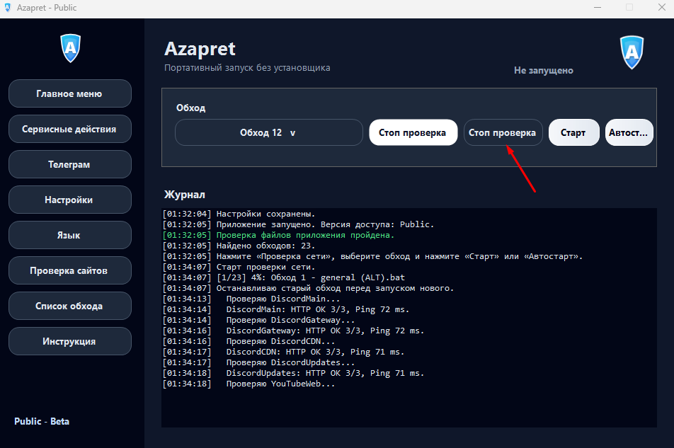

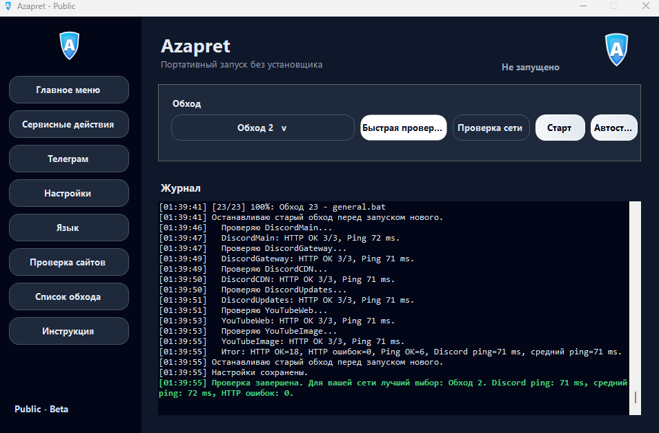

## Start And Autostart

Manual `Start` launches the selected `.bat` profile for the current session.

`Autostart` installs the selected profile as the Windows `zapret` service so it starts with Windows. The launcher verifies that the service is really running before showing success.

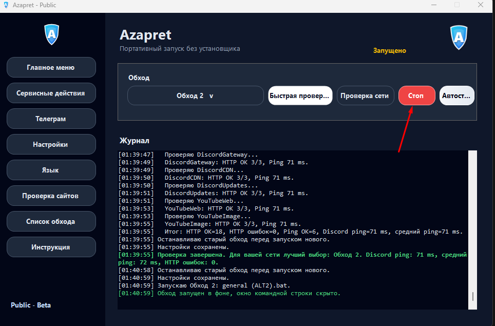

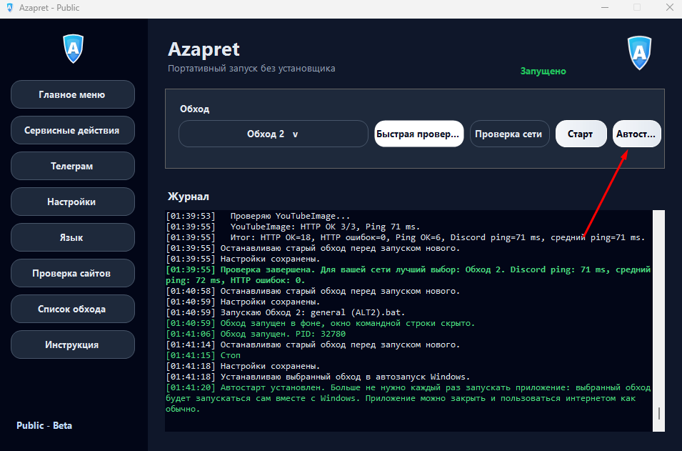

If autostart fails, check:

```text
app\runtime\service-actions.log
```

Also make sure the Windows UAC prompt was accepted.

## Service Tools

The service page contains maintenance actions for common cases.

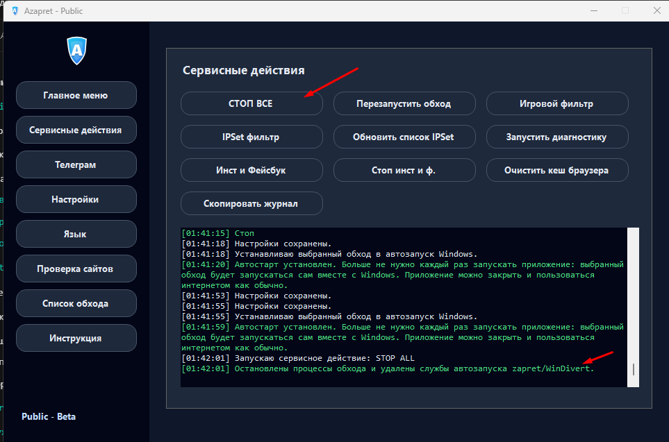

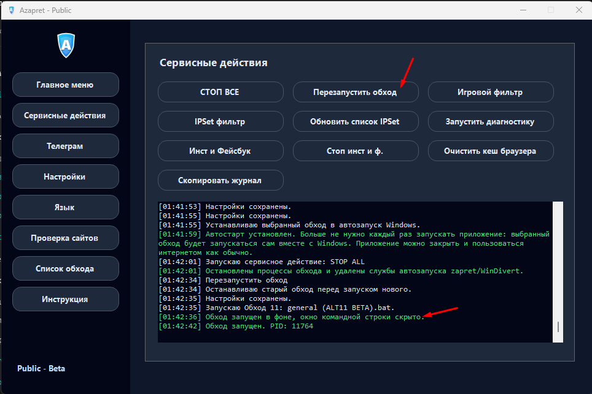

### Game Filter

Use the game filter when games, launchers, voice chat, or matchmaking require additional TCP/UDP handling.

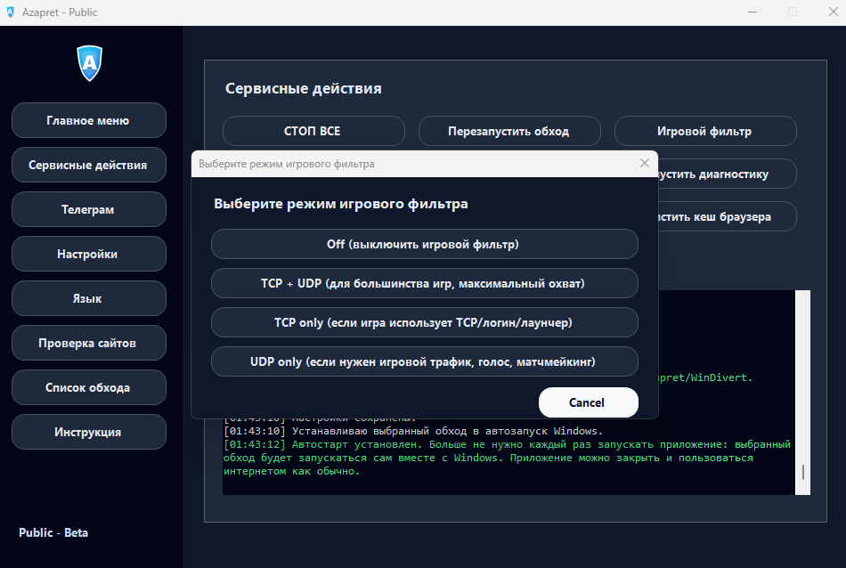

### IPSet Filter

The IPSet filter has three modes:

- `Loaded`: normal mode, uses `lists/ipset-all.txt`.
- `None`: effectively disabled, uses only the reserved `203.0.113.113/32` entry.
- `Any`: empty list mode, applies IPSet rules broadly.

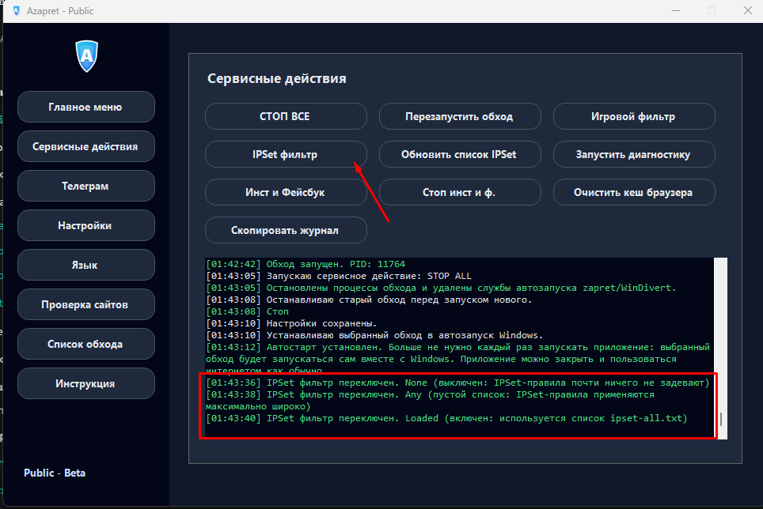

### IPSet Update And Hosts Fix

Use `Обновить список IPSet` / `Update IPSet List` to refresh the bundled IP list.

Use the Instagram/Facebook hosts fix if those domains need DNS assistance on your network.

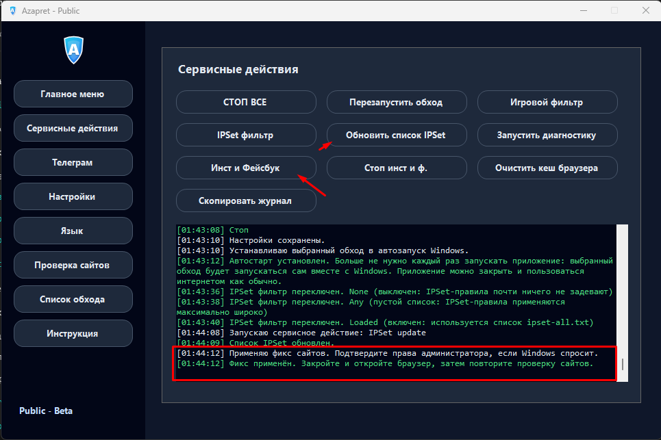

## Telegram Page

The Telegram page helps open proxy settings, view proxy channel instructions, and download Telegram Desktop.

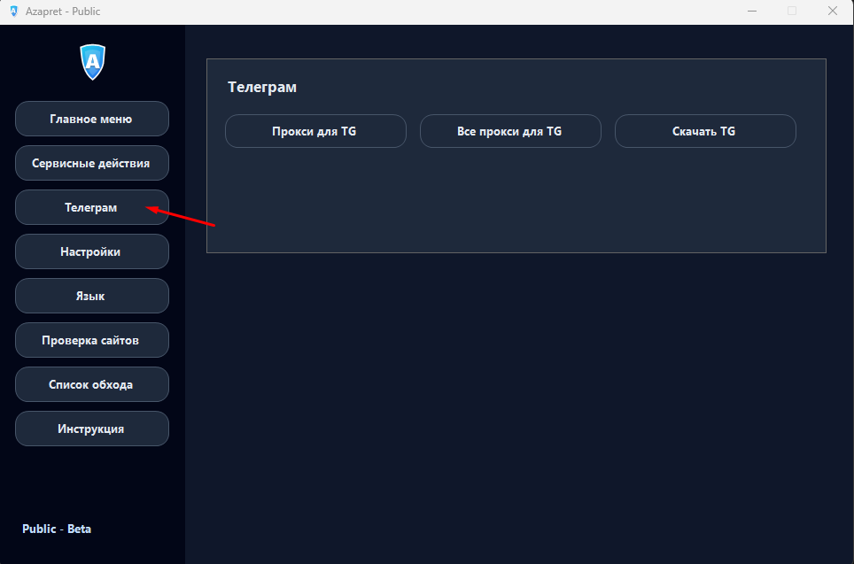

## Settings And Languages

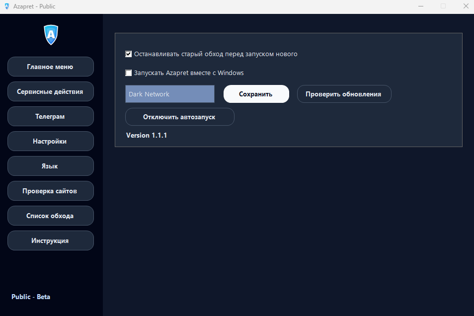

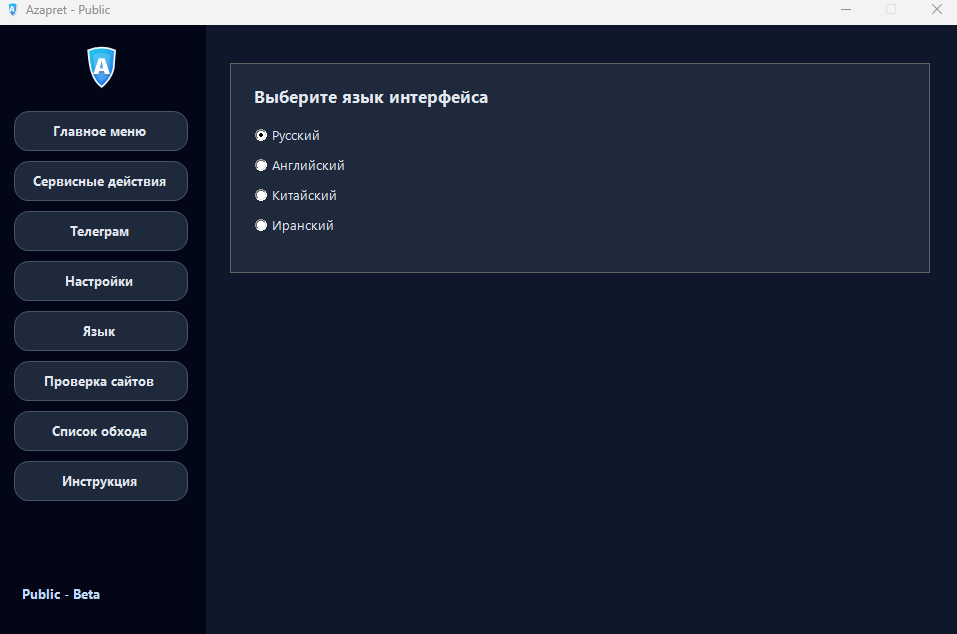

## Included User Domains

The Public user list includes additional domains requested for bypass profiles:

```text
geonix.com
www.geonix.com
hero-sms.com
www.hero-sms.com
```

## Troubleshooting

### Autostart does not install

- Extract the ZIP to a normal folder, for example `C:\AzapretApp-Public`.
- Run `Azapret.exe` from the extracted folder.
- Accept the Windows UAC prompt.
- Check `app\runtime\service-actions.log`.
- If `azapret-service-install-*.cmd` appears in `app\runtime`, run it as administrator to see the Windows/service error directly.

### Manual Start works but Autostart does not

This usually means Windows blocked elevation, service creation, or the UAC prompt was not confirmed. Manual Start and Autostart use different mechanisms: manual Start launches a batch file, Autostart creates the Windows `zapret` service.

### Browser was open during start

Reload the page or restart the browser after changing bypass profiles.

## Project Layout

```text
AzapretApp-Public/       Public application folder
release/                Prebuilt ZIP release
assets/screenshots/     README screenshots
```

## Credits

This launcher packages and automates zapret-style bypass profiles for easier desktop use.

Upstream project inspiration and tooling ecosystem: Flowseal zapret-discord-youtube.

## License

See included upstream files and licenses where applicable. This repository provides the launcher packaging and Public release bundle as-is.
